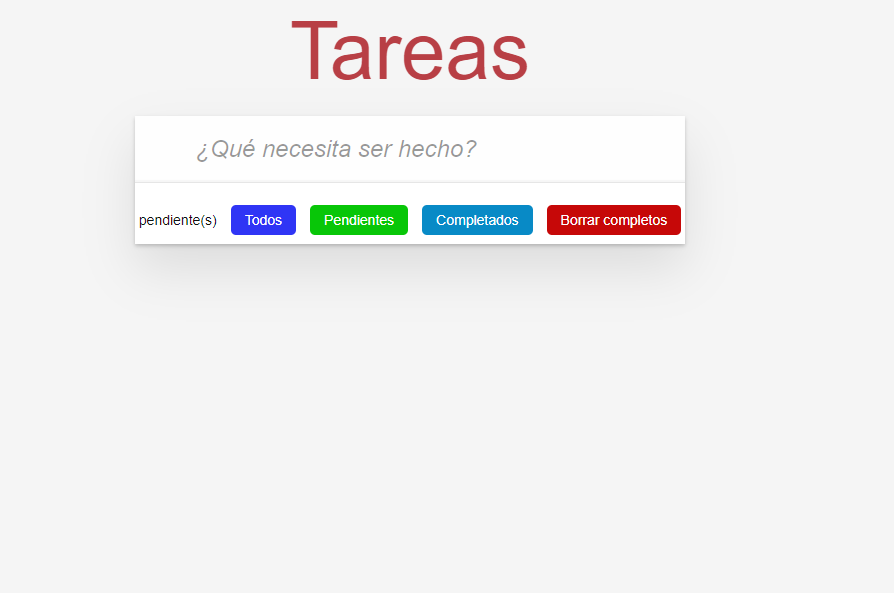
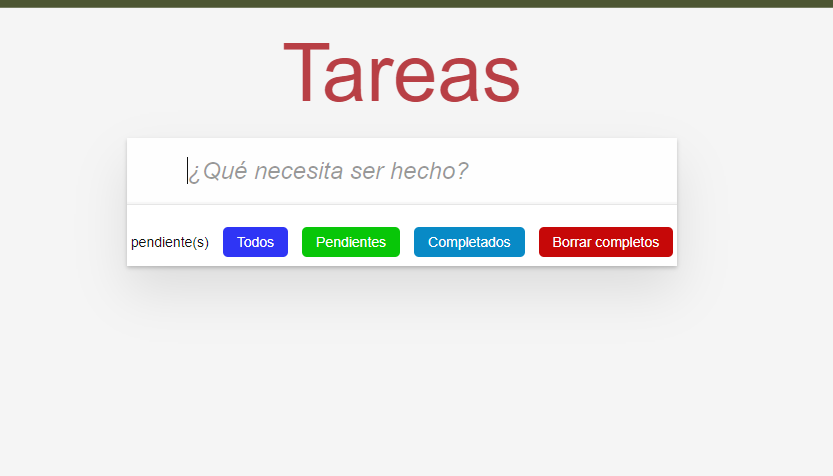
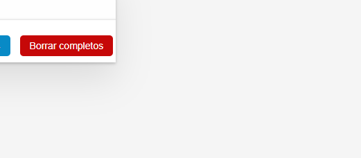
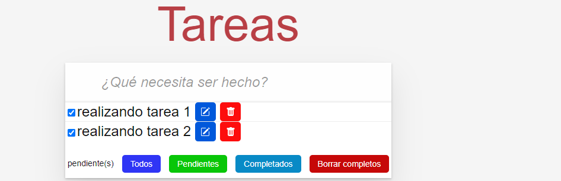
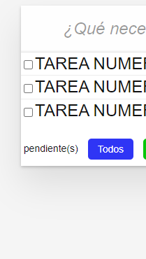

BIENVENIDO AL REPOSTORIO DEL SISTEMA GESTION DE TAREAS
El proyecto SISTEMA DE GESTION DE TAREAS es una página realizada, para ayudar a los usuarios a organizar, realizar un seguimiento y administrar eficientemente sus tareas diarias.Mediante una interfaz intuitiva. Los usuarios pueden crear nuevas tareas, editarlas, marcarlas como completadas o eliminarlas según desee el usuario.

;

Se utiliza html, css, javascript para el desarrollo de la interfaz de usuario y la funcionalidad de la página, además se utiliza git hub para asegurar la colaboración y el control de versiones en el desarrollo de este práctico sistema de gestión de tareas.

funciones principales de nuestro sistema
CREAR UNA NUEVA TAREA
ELIMINAR UNA TAREA
MARCAR UNA TAREA COMO COMPLETADA
CLASIFICAR TAREAS POR DIFERENTES CRIPTERIOS
VISUALIZAR TODAS LAS TAREAS
EDITAR INFORMACION DE UNA TAREA

crear una nueva tarea
La funcionalidad agregar una nueva tarea, permite que los usuarios, puedan registrar e ingresar una nueva tarea, esto implica colocar el título de la tarea y su descripción. Cuando los usuarios seleccionan esta opción, encontrarán un formulario o cuadro de diálogo, en la interfaz de usuario donde puedan realizar lo escrito con anterioridad.

;

Eliminar una tarea
La funcionalidad Eliminar una tarea permite a los usuarios eliminar una tarea existente de la lista de tareas en el sistema de gestión. Esta función es esencial para mantener la lista de tareas actualizada y relevante, eliminando tareas que ya se han completado o que ya no son relevantes.

;

Marcar una tarea como completada
La funcionalidad Marcar una tarea como completada permite a los usuarios indicar que han finalizado una tarea específica en su lista de tareas del sistema de gestión. Esta característica es valiosa para mantener un seguimiento del progreso y la realización de las tareas.

;

Clasificar tareas por diferentes criterios
La funcionalidad “Clasificar tareas por diferentes criterios” permite a los usuarios ordenar y agrupar sus tareas en la lista según diferentes criterios de organización. Esto facilita la visualización y gestión de las tareas de acuerdo con las preferencias individuales del usuario.

;

Al utilizar esta funcionalidad, los usuarios suelen encontrar opciones como pestañas, botones o menús desplegables que les permiten seleccionar cómo desean clasificar las tareas en la interfaz.

Visualizar todas las tareas
Al utilizar esta funcionalidad, los usuarios suelen acceder a una vista que muestra todas las tareas registradas en el sistema, sin importar su estado de finalización. Esto puede presentarse en forma de una lista ordenada o una tabla, donde cada tarea se muestra junto con detalles como su título, prioridad, categoría y estado.

;
Editar información de una tarea
Esta funcionalidad permite a los usuarios, modificar los detalles de una tarea existente, como su título, categoría de prioridad u otros detalles.

uso
Una vez que hayas ingresado al Sistema de Gestión de Tareas en tu entorno, seguir estos pasos te ayudará a comenzar a administrar tus tareas de manera eficiente:

Agregando una Nueva Tarea

Abra la aplicación y navegue a la sección “Agregar Tarea”.
Ingresa el título de la tarea en el campo correspondiente.
Selecciona la prioridad y categoría de la tarea desde las listas desplegables.
Haga clic en el botón “Agregar” para registrar la tarea en el sistema.
Marcar una Tarea como Completada:

En la lista de tareas, localiza la tarea que deseas marcar como completada.
Marque la casilla de verificación junto a la tarea.
La tarea se marcará automáticamente como completada y se moverá a la sección correspondiente.
Editar Información de una Tarea

Encuentra la tarea que deseas editar en la lista.
Haz clic en el botón “Editar” junto a la tarea.
Actualiza los campos que deseas modificar, como título, prioridad o categoría.
Guarda los cambios y la tarea se actualizará con la nueva información.
Eliminar una Tarea:
Ubica la tarea que deseas eliminar en la lista.

Haga clic en el botón “Eliminar” junto a la tarea.
Confirma la eliminación en el mensaje de confirmación.
Clasificar Tareas:

Utiliza las opciones de clasificación en la parte superior de la lista de tareas para organizarlas según tus preferencias.
Selecciona “Todos” para ver todas las tareas, “Pendientes” para ver las que aún no están completadas, y “Completadas” para ver las tareas finalizadas.
Visualizar Todas las Tareas:

Navegue a la sección “Todas las Tareas” para ver una lista completa de todas las tareas registradas, independientemente de su estado.
¡Ahora estás listo para comenzar a usar el Sistema de Gestión de Tareas de manera efectiva y mantener un control organizado de tus responsabilidades diarias!

como usar y ejecutar el proyecto
clona este repositorio en tu maquina local, en la terminal git bash utilizando el comando:

git clone enlace para clonar el repositorio

contribución
¡Agradecemos tu interés en contribuir al Sistema de Gestión de Tareas! Tu colaboración puede ayudar a mejorar y expandir esta herramienta. Aquí hay algunas formas en las que puedes contribuir:

Problemas reporteros
Si encuentra algún problema o error mientras utiliza el sistema, por favor, abra un “problema” en este repositorio. Asegúrese de proporcionar detalles específicos sobre el problema, incluyendo pasos para reproducirlo y detalles del entorno en el que ocurrió.

Sugerir Mejoras
Si tienes ideas para mejorar el sistema o agregar nuevas funcionalidades, nos encantaría escucharlas. Puedes abrir un “asunto” para discutir tus ideas y recibir comentarios de otros colaboradores.

Enviar solicitudes de extracción
Si deseas contribuir directamente con código, te invitamos a enviar una solicitud de extracción (Pull Request). Aquí hay algunos pasos para hacerlo:

Haz un “fork” de este repositorio a tu propia cuenta.
Crea una nueva rama en tu “fork” para trabajar en tu contribución.
Realiza tus cambios y mejoras en esa rama.
Envía la solicitud de extracción desde tu rama hacia la rama principal de este repositorio.
Describa claramente los cambios que ha realizado y cómo benefician al proyecto.
Estilo de Código y Pautas
Si decide enviar una solicitud de extracción con cambios de código, asegúrese de seguir las pautas de estilo de código del proyecto. Puedes encontrar estas pautas en el archivo CONTRIBUTING.MD  de este repositorio.
Gracias por ser parte de este proyecto y contribuir a hacerlo aún mejor. ¡Esperamos ver tus contribuciones!